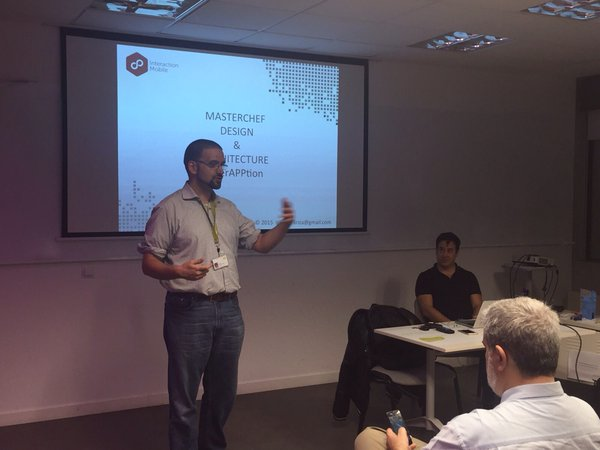

## Adrian Ferreres
<link rel="shortcut icon" type="image/png" href="/favicon.png?">

Hola, soy Adrián, frontend developa al estilo español.  

Porque `España es un gran país que hace cosas importantes y tiene españoles`
Estuve una temporada en Alemania, pero decidí volverme porque `Las decisiones se toman en el momento de tomarse`

Mi vida así en general es muy bonita, porque `Hay cosas bonitas, otras no tanto y no me acuerdo de ninguna`

Me encanta programar, me hace sentir que puedo hacer cualquier cosa, `Yo puedo asegurarles a ustedes que haré todo lo que pueda y un poco más de lo que pueda, si es que eso es posible, y haré todo lo posible e incluso lo imposible, si también lo imposible es posible`

Y solo puedo decir:

`It’s very difficult... todo esto`

FELIZ CUMPLE, BOLLYCAO!!

[Click aquí para saber tu regalo](https://www.youtube.com/watch?v=1XZGHOxnCto)